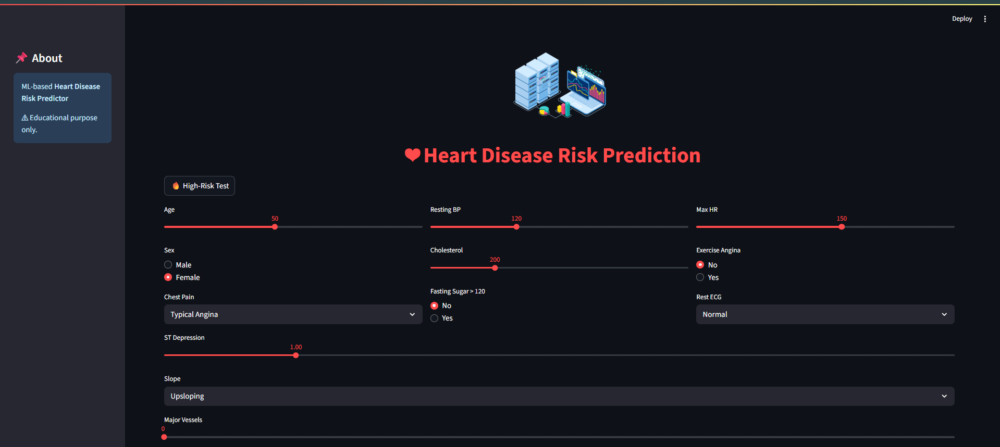
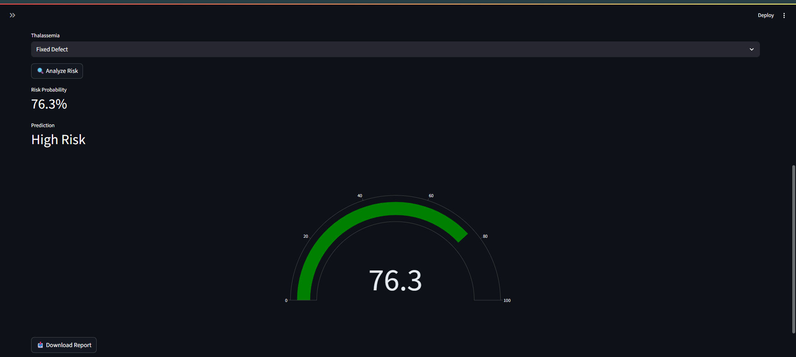
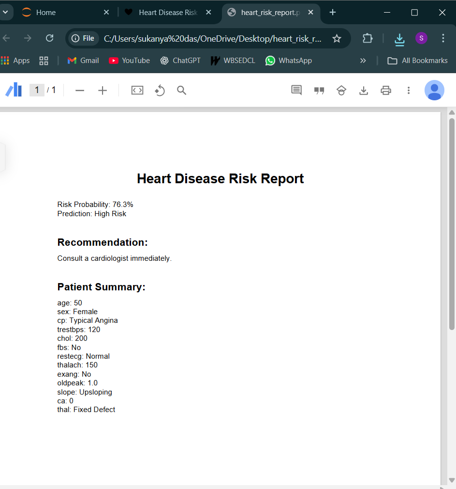

# **🫀 Heart Disease Risk Predictor**

> AI-powered cardiovascular risk assessment tool with interactive web interface

[](https://www.python.org/)
[](https://streamlit.io/)
[](https://scikit-learn.org/)

A machine learning web application that predicts heart disease risk using clinical parameters. Built with Streamlit and featuring real-time predictions, interactive visualizations, PDF report generation, and custom model training capabilities.

=======
# 🫀 Heart Disease Risk Predictor
>>>>>>> 05744b7 (Updated train_and_commit.py)

> AI-powered cardiovascular risk assessment tool with interactive web interface

[](https://www.python.org/)
[](https://streamlit.io/)
[](https://scikit-learn.org/)

A machine learning web application that predicts heart disease risk using clinical parameters. Built with Streamlit and featuring real-time predictions, interactive visualizations, PDF report generation, and custom model training capabilities.


## ✨ Features

### 🔮 Smart Prediction Engine
- Real-time risk assessment with 85%+ accuracy
- Multiple ML algorithms (Random Forest, Logistic Regression, SVM)
- Proper data scaling for accurate predictions
- Risk categorization (Low / Medium / High)

### 🎨 Interactive User Interface
- Beautiful Streamlit UI with animations and dark theme
- Lottie animations for enhanced user experience
- Responsive design that works on all devices
- Intuitive input forms with helpful tooltips

### 📊 Advanced Visualizations
- Gauge charts for risk probability display
- Comparison charts (Patient vs Normal values)
- Feature importance plots for model interpretability
- Progress indicators and color-coded risk levels

### 📋 Professional Reports
- PDF report generation with patient summary
- Download functionality for medical records
- Comprehensive risk analysis with recommendations
- Medical disclaimers and professional formatting

### 🧪 Testing & Validation
- Quick test profiles (Low/Medium/High risk scenarios)
- Debug mode to inspect model inputs
- Model performance metrics and confusion matrices
- Cross-validation support

### 📈 Custom Model Training
- CSV file upload for custom datasets
- Real-time model training with progress tracking
- Multiple algorithm selection
- Model comparison and performance analysis
- Save/download trained models

<<<<<<< HEAD
## 📸 Application Screenshots

### 🏠 Home Page


### 📊 Prediction Result & Risk Gauge


### 📄 PDF Report Generation


=======
## 🚀 Quick Start
>>>>>>> 05744b7 (Updated train_and_commit.py)

### Prerequisites
- Python 3.8 or higher
- pip package manager

### Installation

1. **Clone the repository**
```bash
git clone https://github.com/SukanyaDas-01/heart-disease-predictor.git
cd heart-disease-predictor
```

2. **Create virtual environment**
```bash
python -m venv venv
source venv/bin/activate  # On Windows: venv\Scripts\activate
```

3. **Install dependencies**
```bash
pip install -r requirements.txt
```

4. **Run the application**
```bash
streamlit run app.py
```

5. **Open in browser**
```bash
Local URL: http://localhost:8501
Network URL: http://192.168.0.102:8501
```

<<<<<<< HEAD
**🔁 End-to-End Flow**
```
┌────────────┐
│   Dataset  │
│ heart.csv  │
└─────┬──────┘
      ↓
┌───────────────┐
│ Preprocessing │
│ (Encoding +   │
│ Feature Order)│
└─────┬─────────┘
      ↓
┌───────────────┐
│ StandardScaler│
└─────┬─────────┘
      ↓
┌───────────────┐
│ ML Model      │
│ (RF / LR /    │
│ XGBoost etc.) │
└─────┬─────────┘
      ↓
┌───────────────┐
│ Evaluation    │
│ (Recall, F1,  │
│ ROC-AUC)      │
└─────┬─────────┘
      ↓
┌───────────────┐
│ Saved Pipeline│
│ pipeline.pkl  │
└─────┬─────────┘
      ↓
┌───────────────┐
│ Streamlit App │
│ (Prediction + │
│ Visualization)│
└───────────────┘
```
✅ Scaling + model are encapsulated inside a single `Pipeline`, ensuring safe and consistent inference.

## 🚀 Quick Start

### Prerequisites
- Python 3.8 or higher
- pip package manager

### Installation

1. **Clone the repository**
```bash
git clone https://github.com/SukanyaDas-01/heart-disease-prediction-model-and-webapp.git
cd heart-disease-predictor
```

2. **Create virtual environment** (recommended)
```bash
python -m venv venv
source venv/bin/activate  # On Windows: venv\Scripts\activate
```

3. **Install dependencies**
```bash
pip install -r requirements.txt
```

4. **Run the application**
```bash
streamlit run app.py
```

5. **Open in browser**
```
Local URL: http://localhost:8501
Network URL: http://192.168.0.102:8501
```


## 📁 Project Structure
```
heart-disease-prediction/
=======
```
heart-disease-predictor/
>>>>>>> 05744b7 (Updated train_and_commit.py)
│
├── app.py                      # Main Streamlit application
├── best_model.pkl              # Pre-trained ML model
├── heart_disease.ipynb         # Model training notebook
├── heart.csv                   # Cleveland Heart Disease Dataset
├── requirements.txt            # Python dependencies
├── README.md                   # Project documentation
│
├── screenshots/                # App screenshots and demo
│   ├── demo.gif
│   ├── prediction-results.png
│   └── custom-training.png
│
<<<<<<< HEAD
├── data/
│   └── heart.csv               # Dataset
│
├── models/
│   └── pipeline.pkl            # Trained ML pipeline
│
├── notebooks/
│   └── EDA_and_Modeling.ipynb  # Analysis & experiments
│
├── reports/
│   └── model_comparison.xlsx   # Model performance results
│
├── requirements.txt
├── README.md
└── .gitignore
```

## 📊 Model Experimentation

Multiple models were evaluated using a consistent pipeline:

- Logistic Regression
- Naive Bayes
- SVM
- KNN
- Decision Tree
- Random Forest
- XGBoost
- Neural Network
- Voting Classifier (ensemble)


## Evaluation Metrics

- Recall
- F1 Score
- ROC-AUC

📁 Results saved to:
`reports/model_comparison.xlsx`


## 🚀 Training the Model (Reproducible)

`python src/train.py`

This will:
- Load data
- Apply preprocessing + scaling
- Train the model
- Evaluate performance
- Save the entire pipeline to `models/pipeline.pkl`


## 🌐 Running the Web App

`streamlit run app/app.py`

Features:
- Probability-based risk prediction
- Gauge & comparison charts
- PDF report generation
- Medical disclaimer
- Clean UI with Streamlit

## 📄 PDF Report Output

Each prediction includes:
- Risk probability (%)
- Risk category (Low / Medium / High)
- Patient input summary
- Actionable recommendation

## 🧠 Machine Learning Model

### Dataset
- **Source**: Cleveland Heart Disease Dataset (UCI ML Repository)  
- **Samples**: 303 patients  
- **Features**: 13 clinical parameters  
- **Target**: Binary classification (0: No disease, 1: Disease)  

### Features Used
| Feature | Description | Range |
|---------|-------------|-------|
| Age | Patient age in years | 29-77 |
| Sex | Gender (0: Female, 1: Male) | 0-1 |
| CP | Chest pain type | 0-3 |
| Trestbps | Resting blood pressure (mm Hg) | 94-200 |
| Chol | Serum cholesterol (mg/dl) | 126-564 |
| FBS | Fasting blood sugar > 120 mg/dl | 0-1 |
| RestECG | Resting ECG results | 0-2 |
| Thalach | Maximum heart rate achieved | 71-202 |
| Exang | Exercise induced angina | 0-1 |
| Oldpeak | ST depression induced by exercise | 0-6.2 |
| Slope | Slope of peak exercise ST segment | 0-2 |
| CA | Number of major vessels (0-4) | 0-4 |
| Thal | Thalassemia test result | 1-3 |

### Model Performance
- **Algorithm**: Random Forest Classifier  
- **Accuracy**: 85.2%  
- **Precision**: 84.7%  
- **Recall**: 96.96%  
- **F1-Score**: 86.48%  

## 🎯 Usage Examples

### Basic Prediction
1. Enter patient details in the input form  
2. Click "🔍 Analyze Heart Disease Risk"  
3. View risk probability and recommendations  
4. Download PDF report if needed

## ⚠️ Medical Disclaimer

This project is strictly for educational and research purposes.
- Not a medical diagnosis tool
- Always consult healthcare professionals
- Predictions are based on historical datasets


## 👨‍💻 Author

**Sukanya Das**
- 📧 Email: [sukusukanyadas2001@gmail.com](mailto:sukusukanyadas2001@gmail.com)
- 💼 LinkedIn: [sukanya-das-a05935244](https://www.linkedin.com/in/sukanya-das-a05935244/)
- 🐙 GitHub: SukanyaDas-01(https://github.com/SukanyaDas-01)

## 🙏 Acknowledgments

- **UCI Machine Learning Repository** for the Cleveland Heart Disease Dataset
- **Streamlit** team for the amazing web app framework
- **Scikit-learn** contributors for machine learning tools
- **Plotly** for interactive visualizations
- **Open source community** for continuous inspiration
---

<div align="center">

**⭐ If you found this project helpful, please consider giving it a star! ⭐**

Made with ❤️ by [Sukanya Das](https://github.com/YOUR_USERNAME)

</div>